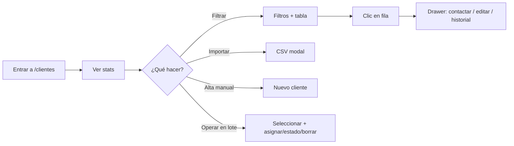

# Web — Sección Clientes (`/clientes`)

> Documentación de la pantalla de administración de clientes del panel web (superadmin).
> Última actualización: **2026-07-09**

---

## Propósito

Permite al superadmin **ver, filtrar, editar e importar** todos los clientes del CRM Lite. Es el centro de operaciones para asignar leads a vendedores y revisar el estado del seguimiento.

**Ruta:** `/clientes`  
**Rol requerido:** `superadmin`  
**Código principal:** `web/src/app/clientes/page.tsx`

---

## Arquitectura de componentes

```
page.tsx (Server Component)
├── ClientesStats      → mini métricas (total, pendientes, vencidos, sin asignar)
├── ImportCsvDialog    → modal CSV con preview y deduplicación
├── AddClientDialog    → alta manual
└── ClientsTable       → filtros + tabla + drawer
    └── ClientDrawer   → ficha completa (editar, contactar, historial, borrar)
```

### Utilidades compartidas

| Archivo | Uso |
|---------|-----|
| `web/src/lib/format-dates.ts` | Etiquetas de seguimiento (“Hoy”, “Hace 3 días (vencido)”) |
| `web/src/lib/contact-links.ts` | Deeplinks WhatsApp / SMS / email / llamada |
| `web/src/components/ui/Combobox.tsx` | Selector con búsqueda (vendedor, tags) |

---

## Mejoras UX/UI (2026-07-09)

### 1. Mini estadísticas arriba
Cuatro tarjetas compactas antes de la tabla:
- **Total** de clientes
- **Pendientes** (estado `pending`)
- **Vencidos** (seguimiento pasado y no ganado/perdido) — en rojo si > 0
- **Sin asignar** — en rojo si > 0

### 2. Tabla simplificada (sin selects inline)
Antes cada fila tenía `<select>` de estado y vendedor → cambios accidentales y UI pesada.

Ahora:
- **Fila entera clickeable** → abre el drawer
- **Estado** y **vendedor** como badges de solo lectura
- **Columna Seguimiento** con fecha relativa + badge “vencido”
- Contacto (teléfono · email · empresa) bajo el nombre

Edición de estado/vendedor/fecha: solo en el **drawer**.

### 3. Filtros ampliados
| Filtro | Tipo |
|--------|------|
| Búsqueda texto | Input (nombre, empresa, tel, email) |
| Estado | Select |
| Vendedor | Combobox (incluye “Sin asignar”) |
| Origen | Select (App/Web, GHL) |
| Tag | Combobox (si hay tags) |
| Vencidos | Toggle |
| Sin asignar | Toggle |

### 4. Drawer enriquecido
- **Acciones rápidas:** WhatsApp, SMS, Email, Llamar (deeplinks, igual que la app vendedor)
- **Link a GHL** si el cliente tiene `crm_contact_id`
- **Preview de tags** como chips mientras se editan
- El formulario se resetea si cambia el cliente seleccionado

### 5. Import CSV en modal
Antes: bloque fijo `SectionCard` siempre visible.

Ahora:
- Botón **Importar CSV** en el header (junto a **Nuevo cliente**)
- Modal con **vista previa** de filas parseadas
- **Deduplicación** por teléfono o email contra clientes existentes (badge “Duplicado” / “Nuevo”)
- Solo importa filas nuevas
- **Plantilla descargable** (`plantilla-clientes.csv`)
- Resumen post-import: “Importados N · M duplicados omitidos”

### 6. Acciones en masa (2026-07-09)
- **Checkbox** por fila + seleccionar todos los visibles (header o botón).
- Barra de acciones cuando hay selección:
  - **Asignar** a vendedor (lote)
  - **Cambiar estado** (lote)
  - **Borrar** con confirmación
- Clic en fila sigue abriendo el drawer; el checkbox no abre el drawer (`stopPropagation`).
- Los filtros definen el universo de “visibles” para seleccionar todos.

---

## Flujo típico del superadmin



---

## Datos y backend

- La página carga **todos** los clientes (`select *`) ordenados por `created_at` desc.
- Sin paginación server-side (ver backlog **WEB-8** para cuando crezca la base).
- El drawer carga historial de `interactions` con join a `profiles`.
- Import CSV hace `insert` batch; dedup es **solo en cliente** (no en servidor).

---

## Pendiente / roadmap relacionado

| ID | Mejora | Estado |
|----|--------|--------|
| WEB-4 | Acciones en masa (reasignar / estado / borrar) | ✅ Hecho (2026-07-09) |
| WEB-8 | Paginación / virtualización | Pendiente |
| WEB-9 | Exportar clientes filtrados a CSV | Pendiente |
| WEB-11 | Filtros guardados en URL | Pendiente |

---

## Cómo probar

1. Arrancar web: `iniciar-web.bat` o `cd web && npm run dev`
2. Login como superadmin → **Clientes**
3. Verificar stats, filtros (vendedor combobox, vencidos, sin asignar)
4. Clic en una fila → drawer con botones de contacto
5. **Importar CSV** → subir archivo, ver preview, confirmar import

**Plantilla de prueba:**
```csv
nombre,telefono,email,empresa,tags
Juan Pérez,+5491112345678,juan@test.com,Empresa SA,warm
```

---

## Archivos tocados (2026-07-09)

- `web/src/app/clientes/page.tsx`
- `web/src/components/clientes/ClientsTable.tsx`
- `web/src/components/clientes/ClientDrawer.tsx`
- `web/src/components/clientes/ImportCsv.tsx` (ahora `ImportCsvDialog`)
- `web/src/components/clientes/ClientesStats.tsx` (nuevo)
- `web/src/components/ui/Combobox.tsx` (nuevo)
- `web/src/lib/contact-links.ts` (nuevo)
- `web/src/lib/format-dates.ts` (nuevo)
